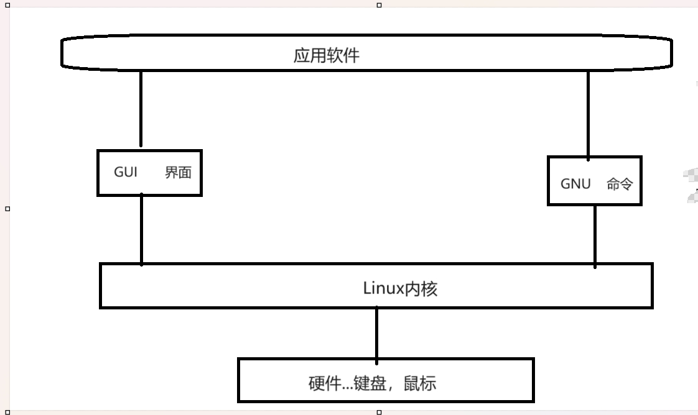

# Linux

> Linux 应该叫GNU/Linux  

### 首先明白Linux入门不是学“Linux”  而是

1.体验：比较和其他系统的不同点和相同点

2.Linux GUI - > Shell

> GUI可理解为桌面程序

### Linux 是一个操作系统 其分为四个部分

1.Linux kernel(内核)

2.GNU工具

3.GUI Desktop环境

4.Application应用

### GNU/Linux




### Linux内核

1.硬件设备管理使用

2.软件程序（系统）------->操作软件

3.系统内存

4.文件管理（保存文件，删除文件，修改文件......）

### 文件系统

读，写的标准

> 不同文件系统有不同的读写标准

```
Windows常用文件系统类型：NTFS
Linux常用文件系统类型：ext,ext2,ext3,ext4(最常用),hpfs,iso9660,JFS,minix,msdos,ncpfs,nfs,ntfs,proc,Reiserfs,smb,sysv,umsdos,vfat(通常是引导使用),XFS,xiafs
(去企业面试可能会被问)
```

### GNU组织

Unix上具有的一些软件，Linux内核本身没有，所以GNU他们模仿Unix,为Linux写了一些必要的软件

- GNU核心：

原本在Unix上的一些命令和工具，被模仿（移植）到了Linux上。

供Linux使用的这套工具：coreutils

coreutilities软件包：

1.用来处理文本的工具

2.用来操作文本的工具

3.用来管理进程的工具

- shell 

shell提供给用户使用的软件：用户拿它来使用电脑，并且和电脑交互。

命令行壳层提供一个命令行界面（CLI）;而图形壳层提供一个图形用户界面（GUI）。

即Shell分为两大类：

1.图形界面Shell  (GUI Shell)

2.命令行界面Shell (GLI Shell)

linux shell--->CLI    Command-Line-Interface

### GLI shell

bash shell   基础shell

zsh(包含ash,korn,tcsh)

> MacOS（苹果系统）----->Unix专业人选择

 

### Linux  GUI发展历史

1.X Windows

2.KDE(windows,MacOS使用系统)

3.GNOME

4.Unity


### shell

> 输入一条命令后按回车
>
> $ 表示当前要输入命令了

入门命令：

```
ls 显示当前目录所有文件夹（不包括隐藏文件夹）

ls -a 显示带点的隐藏文件

```

### 终端

zrq @ q ：~ $ 的含义

用户名@机器名 当前所在目录 等待用户输入

- @ 前是用户名

- @ 后是机器命（计算机名）

- ~ 代表用户home目录

- $ 表示等待用户输入
